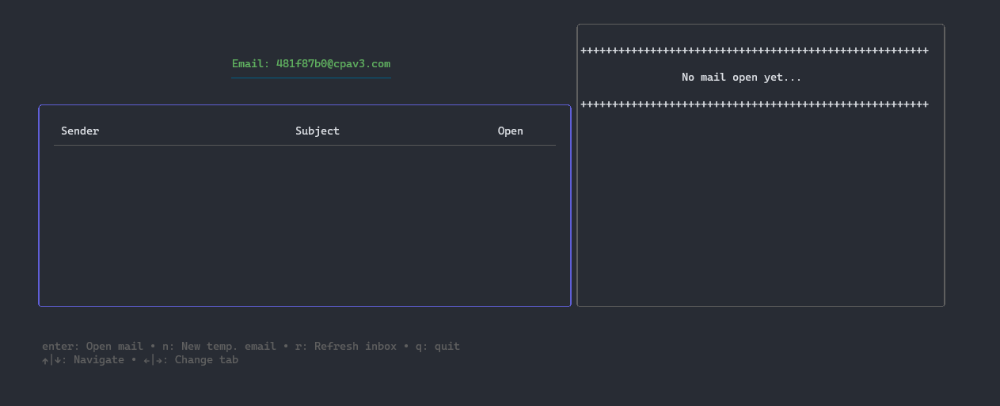
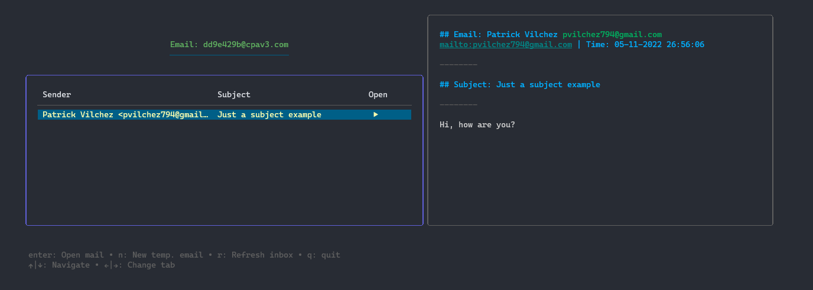

# Temp Mail TUI

Using the [RapidAPI Temp Mail](https://rapidapi.com/Privatix/api/temp-mail), and [BubbleTea](https://github.com/charmbracelet/bubbletea) for TUI like viewports, selectable tables, etc.




## Installation

Create and '.env' file with same entries that example env and run:

```go
go run .
```

## Usage

The program generate a random email, using uuid and split the first part and join with a random domain from Temp Mail API. Use 'r' to refresh the inbox for new messages.
